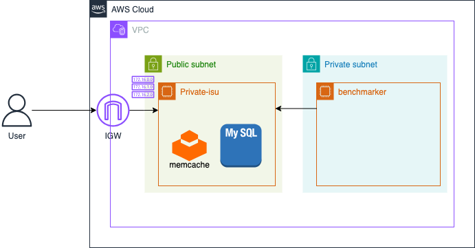

# 概要
  
本セクションでは、AWSの基本的なコンピューティングサービスであるAmazon EC2インスタンスのみを使用して、Private-isuアプリケーションサーバーとベンチマーカーサーバーを構築します。この構成が、今後のパフォーマンスチューニングのベースラインとなります。

提供されたCloudFormationテンプレート (private-isu.yaml) では、VPC、サブネット、インターネットゲートウェイ、ルートテーブル、セキュリティグループ、そして2台のEC2インスタンス（アプリケーションサーバー、ベンチマーカーサーバー）とそれらに紐づくEIPが定義されています。

このワークショップでは、これらのリソースをTerraformで記述・管理するアプローチを取ります。

<details>
<summary>EC2のメリット</summary>
<ul>
<li><strong>柔軟なインスタンスタイプ:</strong> CPU、メモリ、ストレージ、ネットワーク容量の様々な組み合わせから、ワークロードに最適なインスタンスタイプを選択できます。</li>
<li><strong>スケーラビリティ:</strong> 必要に応じてインスタンス数を増減させたり、インスタンスタイプを変更したりすることが容易です。</li>
<li><strong>従量課金:</strong> 実際に使用したコンピューティング時間に対してのみ料金が発生します。</li>
<li><strong>OS選択の自由度:</strong> Linux、Windows Serverなど、様々なOSイメージを選択できます。</li>
<li><strong>フルコントロール:</strong> インスタンスに対する完全な制御権を持ち、OSレベルからの設定やソフトウェアのインストールが可能です。</li>
</ul>
</details>

# 構築手順
1. terraformのmainファイル、VPC、サブネット、EC2インスタンスなどを定義するTerraformファイル（例: main.tf, vpc.tf, ec2.tf）を作成し、編集していきます。

2. 以下は、基本的なネットワーク（VPC、サブネット、インターネットゲートウェイ、ルートテーブル）、セキュリティグループ、EC2インスタンス（アプリケーションサーバー、ベンチマーカー）を定義するTerraformコードです。

  <details>
  <summary>main.tf</summary>

  ```
  terraform {
    required_providers {
      aws = {
        source  = "hashicorp/aws"
        version = "5.91.0"
      }
    }
  }

  provider "aws" {
    region              = "ap-northeast-1"
    allowed_account_ids = [""] #あなたの発行したAWSアカウントのIDを入力してください
    default_tags {
      tags = {
        TerraformName = "CTOA-aws-handsON"
      }
    }
  }

  ```

  </details>

  <details>
  <summary>vpc.tf</summary>

  ```
  resource "aws_vpc" "vpc" {
    cidr_block = "10.10.0.0/16"
    tags = {
      Name = "private-isu-vpc"
    }
  }

  resource "aws_subnet" "public_1a" {
    vpc_id = aws_vpc.vpc.id

    availability_zone = "ap-northeast-1a"
    cidr_block        = "10.10.0.0/24"
  }

  resource "aws_subnet" "public_1c" {
    vpc_id = aws_vpc.vpc.id

    availability_zone = "ap-northeast-1c"
    cidr_block        = "10.10.3.0/24"
  }

  resource "aws_internet_gateway" "gw" {
    vpc_id = aws_vpc.vpc.id
  }

  resource "aws_route_table" "public_1a_rtb" {
    vpc_id = aws_vpc.vpc.id

    route {
      cidr_block = "0.0.0.0/0"
      gateway_id = aws_internet_gateway.gw.id
    }
  }

  resource "aws_route_table_association" "a" {
    subnet_id      = aws_subnet.public_1a.id
    route_table_id = aws_route_table.public_1a_rtb.id
  }

  resource "aws_route_table" "public_1c_rtb" {
    vpc_id = aws_vpc.vpc.id

    route {
      cidr_block = "0.0.0.0/0"
      gateway_id = aws_internet_gateway.gw.id
    }
  }

  resource "aws_route_table_association" "c" {
    subnet_id      = aws_subnet.public_1c.id
    route_table_id = aws_route_table.public_1c_rtb.id
  }
  ```

  </details>

  <details>
  <summary>ec2.tf</summary>

  ```
  #private_isu instance
  resource "aws_instance" "private_isu_web" {
    ami                         = "ami-0505850c059a7302e" #Private-isu-AMI
    instance_type               = "c7a.large"
    iam_instance_profile        = aws_iam_instance_profile.private_isu_web_profile.name
    associate_public_ip_address = true
    vpc_security_group_ids      = [aws_security_group.private_isu_web.id]
    subnet_id                   = aws_subnet.public_1a.id
    user_data                   = <<-EOF
          snap install amazon-ssm-agent --classic
          snap start amazon-ssm-agent

      EOF
    tags = {
      Name = "Private-isu"
    }
  }

  #benchmark instance
  resource "aws_instance" "benchmark" {
    ami                         = "ami-0505850c059a7302e" #Private-isu-AMI
    instance_type               = "c7a.xlarge"
    iam_instance_profile        = aws_iam_instance_profile.private_isu_web_profile.name
    associate_public_ip_address = true
    vpc_security_group_ids      = [aws_security_group.benchmark.id]
    subnet_id                   = aws_subnet.public_1a.id
    user_data                   = <<-EOF
          snap install amazon-ssm-agent --classic
          snap start amazon-ssm-agent

      EOF
    tags = {
      Name = "Private-isu-benchmark"
    }
  }
  ```
  </details>

  <details>
  <summary>sg.tf</summary>

  ```
  resource "aws_security_group" "private_isu_web" {
    name   = "Private-isu"
    vpc_id = aws_vpc.vpc.id
    ingress {
      from_port       = 80
      to_port         = 80
      protocol        = "tcp"
      cidr_blocks      = ["0.0.0.0/0"]
    }

    egress {
      from_port        = 0
      to_port          = 0
      protocol         = "-1"
      cidr_blocks      = ["0.0.0.0/0"]
      ipv6_cidr_blocks = ["::/0"]
    }
  }

  resource "aws_security_group" "benchmark" {
    name   = "Private-isu-benchmark"
    vpc_id = aws_vpc.vpc.id

    egress {
      from_port        = 0
      to_port          = 0
      protocol         = "-1"
      cidr_blocks      = ["0.0.0.0/0"]
      ipv6_cidr_blocks = ["::/0"]
    }
  }
  ```

  </details>

  <details>
  <summary>iam.tf</summary>

  ```
  resource "aws_iam_role" "private_isu_web" {
    name               = "private_isu_web"
    assume_role_policy = data.aws_iam_policy_document.private_isu_web_assume_role.json
  }
  data "aws_iam_policy_document" "private_isu_web_assume_role" {
    statement {
      actions = ["sts:AssumeRole"]

      principals {
        type        = "Service"
        identifiers = ["ec2.amazonaws.com"]
      }
    }
  }

  data "aws_iam_policy" "ssm_managed_instance_core" {
    arn = "arn:aws:iam::aws:policy/AmazonSSMManagedInstanceCore"
  }
  resource "aws_iam_role_policy_attachment" "private_isu_web_ssm_managed_instance_core" {
    role       = aws_iam_role.private_isu_web.name
    policy_arn = data.aws_iam_policy.ssm_managed_instance_core.arn
  }

  # privte-isuインスタンスプロファイルを作成
  resource "aws_iam_instance_profile" "private_isu_web_profile" {
    name = "private-isu-web-instance-profile"
    role = aws_iam_role.private_isu_web.name
  }
  ```

  </details>

3. 実行環境で terraform init を実行して初期化します。
    ```
    terraform init
    ```

4. 実行計画を確認します。
   ```
   terraform plan
   ```
    エラーが出ていないこと、意図したリソースが作成されることを確認して適用します。
    ```
    terraform apply
    ```

5. 動作確認  
    まずはアプリケーションサーバーでPrivate-isuアプリケーションが起動していることを確認します。  
    `http://{private-isu ip}`にアクセスし、画面が表示されるか確認しましょう。

    次に、各EC2インスタンスにSSMで接続できることを確認します。接続後にユーザー変更も行っておきます。  
    ```
    aws ssm start-session --target {instance_ID}
    
    # ユーザー変更
    sudo su - isucon
    ```

6. ベンチマークの初回実行

    ベンチマーカーで以下のコマンドを実行すると、アプリケーションサーバーに対してベンチマークを実行できます。
    ```
    /home/isucon/private_isu/benchmarker/bin/benchmarker -u /home/isucon/private_isu/benchmarker/userdata -t http://{private-isu ip}
    ```

    ここで、アプリケーションサーバーで`top`コマンドを実行すると、マシンの負荷を観測することができます。初期状態では、特にMySQLのCPU利用率が非常に高いことが分かりますね。
    


    1分ほど待つとスコアが表示されます。何点になったでしょうか？  
    これが今後の改善のベースラインとなるので記録しておきましょう！  

 [⬅️ 前のセクションへ](../01-initial-environment/README.md)　　　[次のセクションへ ➡️](../03-database-migration-to-aurora/README.md)