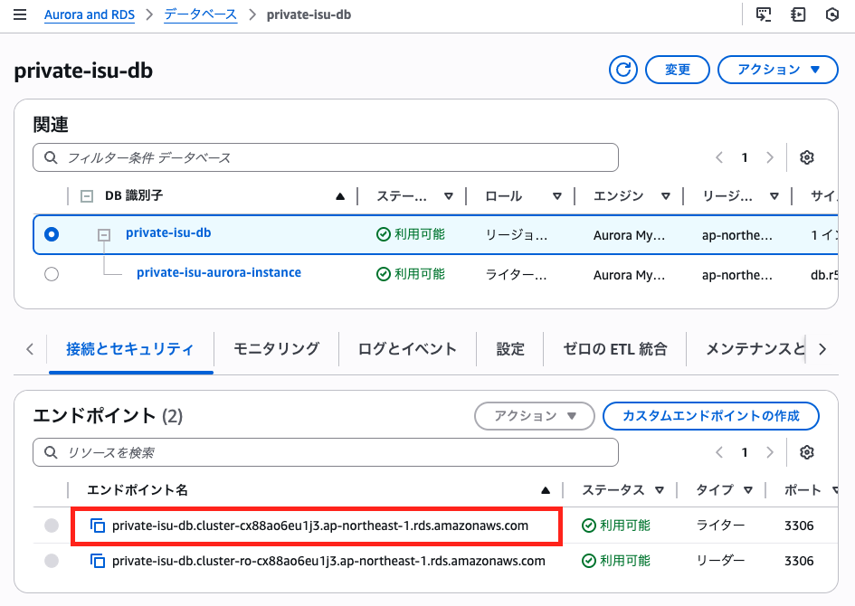

# 概要
  
本セクションではPrivate-isuインスタンス内で稼働していたMySQLをAWSのマネージド型リレーショナルデータベースサービスであるAmazon RDSに切り出していきます。  
RDSではクラスターと呼ばれる構成で、読み書き可能なプライマリDBインスタンスと、読み取りのみのレプリカDBインスタンス、クラスタボリュームを管理しています。  
また、アプリケーションからアクセスする為のネットワーク経路もRDS用に必要となっています。  

<!-- TODO 構成図追加 -->

<details>
<summary>RDSのメリット</summary>
<ul>
<li><strong>運用負荷削減:</strong>面倒な管理作業を自動化し、本業に専念できます。</li>
<li><strong>容易な構築・拡張:</strong>すぐにDBを開始でき、リソース変更も簡単です。</li>
<li><strong>高可用性:</strong> 障害時も自動復旧し、サービス停止を最小化します。</li>
<li><strong>エンジン選択自由:</strong> 人気DBやAuroraなど、最適なエンジンを選べます。</li>  
<li><strong>コスト最適化:</strong> 使った分だけ支払い、初期費用は不要です。</li>
<li><strong>堅牢なセキュリティ:</strong> 多層的な保護でデータを安全に守ります。</li>
</ul> 
</details>

# 構築手順
1. Auroraクラスター、インスタンスを定義するTerraformファイル `aurora.tf` を作成します。
2. 以下がRDSクラスタ、RDSインスタンスを定義するterraformファイルです。コードをコピーして`aurora.tf`ファイルに追加してください。
    <details>
    <summary>RDSクラスタ</summary>

    ```
    resource "aws_rds_cluster" "private_isu_db" {
        availability_zones                    = ["ap-northeast-1a", "ap-northeast-1c", "ap-northeast-1d"]
        cluster_identifier                    = "private-isu-db"
        database_insights_mode                = "advanced"
        database_name                         = "isuconp"
        db_cluster_parameter_group_name       = "default.aurora-mysql8.0"
        db_subnet_group_name                  = aws_db_subnet_group.private_isu_aurora.name
        delete_automated_backups              = false
        deletion_protection                   = false
        enabled_cloudwatch_logs_exports       = ["slowquery"]
        engine                                = "aurora-mysql"
        engine_lifecycle_support              = "open-source-rds-extended-support-disabled"
        engine_mode                           = "provisioned"
        engine_version                        = "8.0.mysql_aurora.3.05.2"
        master_password                       = "password" # NOTE: 本来はパスワードを別で管理する
        master_username                       = "isuconp"
        monitoring_interval                   = 60
        monitoring_role_arn                   = aws_iam_role.private_isu_rds_monitoring_role.arn
        network_type                          = "IPV4"
        performance_insights_enabled          = true
        performance_insights_retention_period = 465
        port                                  = 3306
        storage_type                          = "aurora-iopt1"
        skip_final_snapshot                   = true
        vpc_security_group_ids                = [aws_security_group.private_isu_aurora.id]
    }
    ```

    </details>

    <details>
    <summary>RDSインスタンス</summary>

    ```
    resource "aws_rds_cluster_instance" "private_isu_db_instance" {
        cluster_identifier                    = "private-isu-db"
        db_parameter_group_name               = "default.aurora-mysql8.0"
        db_subnet_group_name                  = aws_db_subnet_group.private_isu_aurora.name
        engine                                = "aurora-mysql"
        engine_version                        = "8.0.mysql_aurora.3.05.2"
        identifier                            = "private-isu-aurora-instance"
        instance_class                        = "db.r5.large"
        monitoring_interval                   = 60
        monitoring_role_arn                   = aws_iam_role.private_isu_rds_monitoring_role.arn
        performance_insights_enabled          = true
        performance_insights_retention_period = 465
        tags = {
            devops-guru-default = "private-isu-aurora"
        }
        depends_on = [aws_rds_cluster.private_isu_db]
    }
    ```
    </details>

    その他、ネットワーク、セキュリティグループ、IAMロールの設定を行います。これらは`vpc.tf`、`sg.tf`、`iam.tf`にそれぞれ追加してください。

    <details>
    <summary>ネットワーク</summary>

    ```
    # vpc.tf に追記

    resource "aws_db_subnet_group" "private_isu_aurora" {
        name       = "private-isu-mysql-subnet-group"
        subnet_ids = [aws_subnet.mysql-a.id, aws_subnet.mysql-c.id]

        tags = {
            Name = "private-isu aurora subnet group"
        }
    }

    resource "aws_subnet" "mysql-a" {
        vpc_id = aws_vpc.vpc.id

        availability_zone = "ap-northeast-1a"
        cidr_block        = "10.10.9.0/24"
    }

    resource "aws_subnet" "mysql-c" {
        vpc_id = aws_vpc.vpc.id

        availability_zone = "ap-northeast-1c"
        cidr_block        = "10.10.11.0/24"
    }

    resource "aws_subnet" "mysql-d" {
        vpc_id = aws_vpc.vpc.id

        availability_zone = "ap-northeast-1d"
        cidr_block        = "10.10.12.0/24"
    }
    ```
    </details>

    <details>
    <summary>セキュリティグループ</summary>

    ```
    # sg.tf に追記

    resource "aws_security_group" "private_isu_aurora" {
        name   = "Private-isu-aurora"
        vpc_id = aws_vpc.vpc.id
        ingress {
            from_port       = 3306
            to_port         = 3306
            protocol        = "tcp"
            security_groups = [aws_security_group.private_isu_web.id]
        }
    }
    ```
    </details>

    <details>
    <summary>IAMロール</summary>

    ```
    # iam.tf に追記

    data "aws_iam_policy" "enhanced_monitoring" {
        arn = "arn:aws:iam::aws:policy/service-role/AmazonRDSEnhancedMonitoringRole"
    }

    resource "aws_iam_role" "private_isu_rds_monitoring_role" {
        name = "private-isu-rds-monitoring-role"
        assume_role_policy = jsonencode({
            Version = "2012-10-17"
            Statement = [
            {
                Action = "sts:AssumeRole"
                Effect = "Allow"
                Principal = {
                Service = "rds.amazonaws.com"
                }
            },
            {
                Action = "sts:AssumeRole"
                Effect = "Allow"
                Principal = {
                Service = "monitoring.rds.amazonaws.com"
                }
            },
            {
                Action = "sts:AssumeRole"
                Effect = "Allow"
                Principal = {
                Service = "ec2.amazonaws.com"
                }
            },
            ]
        })

        tags = {
            Name = "private-isu RDS Monitoring Role"
        }
    }

    resource "aws_iam_role_policy_attachment" "enhanced_monitoring_attachment" {
        role       = aws_iam_role.private_isu_rds_monitoring_role.name
        policy_arn = data.aws_iam_policy.enhanced_monitoring.arn
    }
    ```
    </details>

3. 実行環境で実行計画を確認します。 
    ```
    terraform plan
    ```  
    エラーが出てないことを確認して適用していきます。  
    ```
    terraform aplly
    ```

    ---

    DBの作成には時間がかかります(10分ほどかかることも)。この間に、以下のことを行っていきましょう！

    - アプリケーションを実際に触ってみる
    - DBをAuroraに切り出すことでパフォーマンスが上がるか、下がるか予想を立てる

    ---

4. DBの移行  
    Private-isuインスタンスに入ってsqlディレクトリを作成してください。
    ```
    cd ~/private_isu
    mkdir /home/isucon/private_isu/webapp/sql
    ```

    次に下記のコマンドを実行するとDB移行に必要なダンプファイルが作成されます。
    ```
    make init
    ```
    
    ダンプファイルを作成したらDBを移行します(こちらも少し時間がかかります)。  

    ```
    bunzip2 -c webapp/sql/dump.sql.bz2 | mysql -h {Auroraのエンドポイント} -uisuconp -ppassword
    ```

    ※上記コマンドではホスト部分にAuroraのエンドポイントが必要ですが、AWSコンソールからAuroraクラスターのライターのエンドポイントをコピーして使います。

    
    

    アプリケーションの向き先を変更します。`~/env.sh`ファイルを開き以下の様に編集します。
    ```
    PATH=/usr/local/bin:/home/isucon/.local/ruby/bin:/home/isucon/.local/node/bin:/home/isucon/.local/python3/bin:/home/isucon/.local/perl/bin:/home/isucon/.local/php/bin:/home/isucon/.local/php/sbin:/home/isucon/.local/go/bin:/home/isucon/.local/scala/bin:/usr/bin/:/bin/:$PATH
    ISUCONP_DB_USER=isuconp
    ISUCONP_DB_PASSWORD=password # 変更
    ISUCONP_DB_NAME=isuconp
    ISUCONP_DB_HOST=<Auroraのエンドポイント> # 変更
    ```

    Private-isuアプリを再起動してください。
    ```
    sudo systemctl daemon-reload
    sudo systemctl restart isu-ruby
    ```

5. ベンチマークの実行  
スコアが上がるか、下がるか予想を立てて現在の構成でベンチマークを実行してみてください。
スコアが変動した原因も考察してみてください。

`top`コマンドを実行すると、初回実行で首位だったMySQLがいなくなっているはずです。


6. スロークエリの検出
AWSコンソール上でRDSを検索し、`Performance insights`から先ほど建てたインスタンスを指定します。  
ディメンションのトップSQLからボトルネックのクエリを特定しましょう。

    <details>

    <summary>インデックス追加</summary>

    Performance insightsより以下のクエリがボトルネックとわかりました。  


    ```SQL
    SELECT * FROM `comments` WHERE `post_id` = ? ORDER BY `created_at` DESC LIMIT ?;
    ```

    こちらのクエリは `post_id` が一致する行を全て探索し、その後 `created_at` でソートしています。そこで、 `post_id` に対してインデックスを作成してみましょう。

    ```
    # mysqlに接続
    mysql -h <Auroraのエンドポイント> -uisuconp -ppassword
    ```

    ```SQL
    # インデックスを追加
    use isuconp;
    create index post_id_created_at_idx on comments (post_id, created_at DESC);
    ```

    では、再度ベンチマークを実行してみましょう。ベンチマーク終了後、スコアを記録してください。  
    また、`Performance insights`を再度開いて、先ほどのクエリが改善されているか確認してみてください。

    </details>

[⬅️ 前のセクションへ](../02-ec2-only-setup/README.md)　　　[次のセクションへ ➡️](../04-adding-alb/README.md)