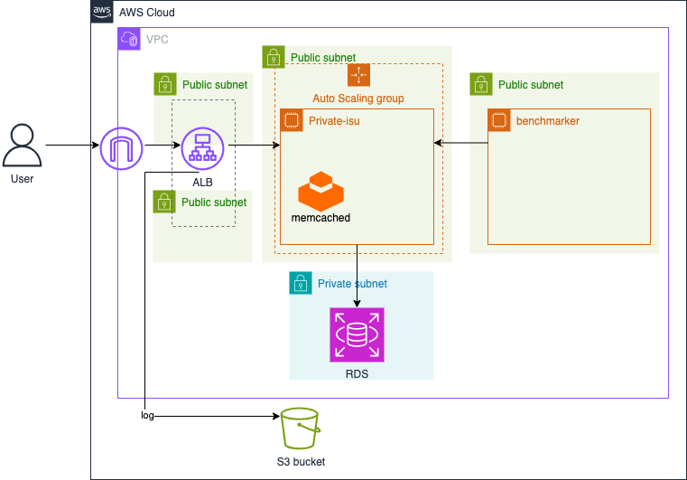
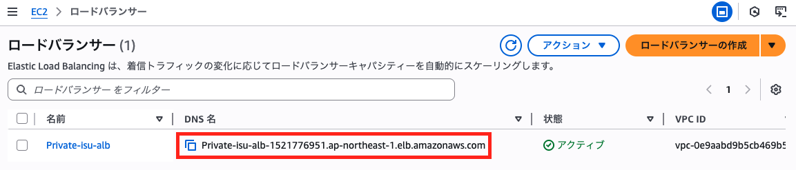

# 概要
  
本セクションでは、Private-isuアプリケーションの前にApplication Load Balancer (ALB) を導入します。ALBはOSI参照モデルの第7層（アプリケーション層）で動作するロードバランサーで、HTTP/HTTPSトラフィックを複数のターゲット（この時点ではEC2インスタンス1台）に分散します。

ALBを導入する主な目的は以下の2点です。

- **アクセスログの収集と分析**: ALBのアクセスログをS3バケットに保存し、後続のセクションでAmazon Athenaを用いて分析することで、アプリケーションのボトルネックを特定しやすくします。  
- **将来的なスケールアウトへの対応**: 今後のステップでEC2インスタンスを複数台構成にする際に、トラフィックを効率的に分散するための基盤となります。  

# 構築手順
1. ALB関連のリソースを定義するTerraformファイル `alb.tf` を作成し、編集していきます。  
    ALBからのアクセスを許可するように、アプリケーションサーバー用EC2のセキュリティグループを更新する必要がある点に注意してください。
2. 以下にALB、ターゲットグループ、リスナー、およびALB用のセキュリティグループ、アクセスログ用S3バケットを定義するTerraformコードの例を示します。これらを `alb.tf` (または既存のtfファイル) に追加してください。

    <details>
    <summary>alb.tf</summary>

    ```
    data "aws_caller_identity" "current" {}
    data "aws_elb_service_account" "tf_elb_service_account" {}

    resource "aws_lb" "private_isu_alb" {
      name               = "Private-isu-alb"
      internal           = false
      load_balancer_type = "application"
      security_groups    = [aws_security_group.alb.id]
      subnets            = [aws_subnet.public_1a.id, aws_subnet.public_1c.id]

      access_logs {
        bucket  = aws_s3_bucket.lb_logs.id
        prefix  = "private-isu"
        enabled = true
      }
    }

    resource "aws_lb_target_group" "private_isu" {
      name     = "Private-isu"
      port     = 80
      protocol = "HTTP"
      vpc_id   = aws_vpc.vpc.id

      health_check {
        path                = "/"
        interval            = 30
        timeout             = 5
        healthy_threshold   = 2
        unhealthy_threshold = 2
        matcher             = "200-299"
      }
    }

    resource "aws_lb_target_group_attachment" "private_isu" {
      target_group_arn = aws_lb_target_group.private_isu.arn
      target_id        = aws_instance.private_isu_web.id
    }

    resource "aws_lb_listener" "private_isu" {
      load_balancer_arn = aws_lb.private_isu_alb.arn
      port              = 80
      protocol          = "HTTP"

      default_action {
        type             = "forward"
        target_group_arn = aws_lb_target_group.private_isu.arn
      }
    }

    resource "aws_s3_bucket" "lb_logs" {
      bucket = "private-isu-alb-logs-${data.aws_caller_identity.current.account_id}"
    }

    resource "aws_s3_bucket_policy" "lb_logs" {
      bucket = aws_s3_bucket.lb_logs.id

      policy = data.aws_iam_policy_document.lb_logs_policy.json
    }

    data "aws_iam_policy_document" "lb_logs_policy" {
      statement {
        actions = ["s3:PutObject"]

        principals {
          type        = "AWS"
          identifiers = [data.aws_elb_service_account.tf_elb_service_account.arn]
        }

        resources = [
          "${aws_s3_bucket.lb_logs.arn}/*",
        ]
      }
    }
    ```

    </details>

    <details>
    <summary>sg.tf</summary>

    ```
    resource "aws_security_group" "private_isu_web" {
      name   = "Private-isu"
      vpc_id = aws_vpc.vpc.id
      ingress {
        from_port       = 80
        to_port         = 80
        protocol        = "tcp"
        security_groups = [aws_security_group.alb.id] # 変更
      }

      egress {
        from_port        = 0
        to_port          = 0
        protocol         = "-1"
        cidr_blocks      = ["0.0.0.0/0"]
        ipv6_cidr_blocks = ["::/0"]
      }
    }

    resource "aws_security_group" "benchmark" {
      name   = "Private-isu-benchmark"
      vpc_id = aws_vpc.vpc.id

      egress {
        from_port        = 0
        to_port          = 0
        protocol         = "-1"
        cidr_blocks      = ["0.0.0.0/0"]
        ipv6_cidr_blocks = ["::/0"]
      }
    }

    resource "aws_security_group" "private_isu_aurora" {
      name   = "Private-isu-aurora"
      vpc_id = aws_vpc.vpc.id
      ingress {
        from_port       = 3306
        to_port         = 3306
        protocol        = "tcp"
        security_groups = [aws_security_group.private_isu_web.id]
      }
    }

    # 追加
    resource "aws_security_group" "alb" {
      name   = "Private-isu-alb"
      vpc_id = aws_vpc.vpc.id

      egress {
        from_port        = 0
        to_port          = 0
        protocol         = "-1"
        cidr_blocks      = ["0.0.0.0/0"]
        ipv6_cidr_blocks = ["::/0"]
      }
    }

    resource "aws_vpc_security_group_ingress_rule" "alb" {
      security_group_id = aws_security_group.alb.id
      from_port         = 80
      to_port           = 80
      ip_protocol       = "tcp"
      cidr_ipv4         = "0.0.0.0/0"
    }
    ```

    </details>


3. 実行計画を確認し、適用します。
    ```
    terraform plan
    terraform apply
    ```

4. 動作確認
    ALBのDNS名にブラウザでアクセスし、アプリケーションが表示されることを確認します。
    EC2インスタンスのセキュリティグループが更新され、ALBからのみアクセスを受け付けるようになっているか確認します（直接EIPにアクセスできなくなっているかなど）。
    S3バケットにALBのアクセスログが出力され始めていることを確認します（数分かかる場合があります）。

5. ベンチマークの実行
    ALB経由でベンチマークを実行し、スコアを比較してください。
    ```
    /home/isucon/private_isu/benchmarker/bin/benchmarker -u /home/isucon/private_isu/benchmarker/userdata -t http://{ALBのDNS名}
    ```

    ※ALBのDNS名はAWSマネジメントコンソールのEC2ダッシュボードから確認できます。
    

[⬅️ 前のセクションへ](../03-database-migration-to-aurora/README.md)　　　[次のセクションへ ➡️](../05-athena-log-analysis/README.md)
