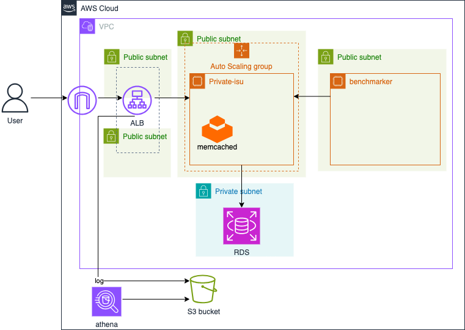

# 概要
  
本セクションでは、Amazon Athena を使用して、S3バケットに保存されたALB (Application Load Balancer) のアクセスログを分析します。Athenaはサーバーレスのインタラクティブクエリサービスであり、標準SQLを使用してS3上のデータを直接、簡単に分析できます。

この分析を通じて、Private-isuアプリケーションのどのパスが多くアクセスされているか、レスポンスタイムが遅いリクエストは何か、エラーが発生している箇所はどこか、といった情報を把握し、パフォーマンス改善のヒントを得ることを目的とします。

<details>
<summary>Athenaのメリット</summary>
<ul>
<li><strong>サーバーレス:</strong> インフラ管理不要ですぐにクエリを実行できます。</li>
<li><strong>従量課金:</strong> スキャンしたデータ量に基づいて課金されるため、コスト効率が良いです。</li>
<li><strong>標準SQL:</strong> 使い慣れたSQLでS3上のデータを直接分析できます。</li>
<li><strong>スキーマオンリード:</strong> データロード前にスキーマを定義する必要がありません（テーブル定義は必要）。</li>
</ul>
</details>


## 前提条件:
前のセクション「④ALB追加」が完了しており、ベンチマークを実行してALBのアクセスログがS3バケットに出力されていること。  

# 分析手順
1. クエリを実行する為のワークグループと、実行したクエリを保存するバケットを定義するTerraformファイル`athena.tf`を作成し、編集していきます。
   <details>
    <summary>athena</summary>

    ```
    resource "aws_athena_workgroup" "example" {
      name = "private-isu-workgroup"

      configuration {
        enforce_workgroup_configuration    = true
        result_configuration {
          output_location = "s3://${aws_s3_bucket.lb_logs.bucket}/athena/"
        }
      }
    }
    ```
    </details>
  
  作成が完了したら、Athenaのクエリエディタ画面からワークグループを`private-isu-workgroup`に切り替えます。

  

2.  データベースの作成  
    Athenaのクエリエディタで以下を実行します。
    ```
    CREATE DATABASE IF NOT EXISTS private_isu_alb_db;
    ```
3. ALBアクセスログ用テーブルの作成
    クエリエディタで、データベース private_isu_alb_db を選択し、以下の CREATE EXTERNAL TABLE 文を実行します。  
    なお、クエリ末尾にある
    ```
    s3://<ログフォルダの場所>/
    ```
    は、ALBのアクセスログが保存されているS3バケットのパス
    ```
    s3://private-isu-alb-logs-<アカウントID>/private-isu/AWSLogs/<アカウントID>/elasticloadbalancing/us-east-1/
    ```
    に置き換えます。

    <details>
    <summary>テーブル作成クエリ</summary>

    ```
    CREATE EXTERNAL TABLE IF NOT EXISTS alb_access_logs (
            type string,
            time string,
            elb string,
            client_ip string,
            client_port int,
            target_ip string,
            target_port int,
            request_processing_time double,
            target_processing_time double,
            response_processing_time double,
            elb_status_code int,
            target_status_code string,
            received_bytes bigint,
            sent_bytes bigint,
            request_verb string,
            request_url string,
            request_proto string,
            user_agent string,
            ssl_cipher string,
            ssl_protocol string,
            target_group_arn string,
            trace_id string,
            domain_name string,
            chosen_cert_arn string,
            matched_rule_priority string,
            request_creation_time string,
            actions_executed string,
            redirect_url string,
            lambda_error_reason string,
            target_port_list string,
            target_status_code_list string,
            classification string,
            classification_reason string,
            conn_trace_id string
            )
            ROW FORMAT SERDE 'org.apache.hadoop.hive.serde2.RegexSerDe'
            WITH SERDEPROPERTIES (
            'serialization.format' = '1',
            'input.regex' = 
        '([^ ]*) ([^ ]*) ([^ ]*) ([^ ]*):([0-9]*) ([^ ]*)[:-]([0-9]*) ([-.0-9]*) ([-.0-9]*) ([-.0-9]*) (|[-0-9]*) (-|[-0-9]*) ([-0-9]*) ([-0-9]*) \"([^ ]*) (.*) (- |[^ ]*)\" \"([^\"]*)\" ([A-Z0-9-_]+) ([A-Za-z0-9.-]*) ([^ ]*) \"([^\"]*)\" \"([^\"]*)\" \"([^\"]*)\" ([-.0-9]*) ([^ ]*) \"([^\"]*)\" \"([^\"]*)\" \"([^ ]*)\" \"([^\\s]+?)\" \"([^\\s]+)\" \"([^ ]*)\" \"([^ ]*)\" ?([^ ]*)?'
            )
            LOCATION 's3://<ログフォルダの場所>/'

    ```

    </details>

4. ログをグループ化して出力  
    以下のクエリを実行して、ALBのアクセスログをURL・HTTPメソッドごとにグループ化し、それぞれのリクエスト数と合計処理時間を取得します。  
    ```
    WHERE request_creation_time >= '2025-05-28T08:00:00.000000Z' --ベンチマーカーの実行時間(UTC)に設定
    ```
    の部分では、ベンチマーカーの実行時間から9時間前のUTC時間に設定することで、特定のベンチマーク実行時のログのみを対象にできます。

    <details>
    <summary>グループ化クエリ</summary>

    ```
    WITH logs AS (
    SELECT 
    request_verb AS method,
    regexp_replace(request_url, '^https?://[^/]+', '') AS path,
    target_processing_time,
    request_creation_time
    FROM alb_access_logs
    WHERE request_creation_time >= '2025-05-28T08:00:00.000000Z' --ベンチマーカーの実行時間(UTC)に設定
    ),
    grouped_logs AS (
      SELECT 
        method,
        CASE
        WHEN path LIKE '/posts?max_created_at=%' THEN '/posts?max_created_at=*'
        WHEN path LIKE '/posts/%' THEN '/posts/*'
        WHEN path LIKE '/@%' THEN '/user/*'
        WHEN path LIKE '/image/%' THEN '/image/*'
        ELSE path
      END AS request_url_base,
      target_processing_time
      FROM logs
      )
      SELECT 
      method,
      request_url_base,
      SUM(target_processing_time) AS total_processing_time
      FROM grouped_logs
      GROUP BY method, request_url_base
      ORDER BY total_processing_time DESC;
    ```

    </details>

    ※もし結果が表示されない場合は以下を確認しましょう。
    - テーブル作成クエリの`<ログフォルダの場所>`が正しく設定されているか
    - グループ化クエリの`WHERE request_creation_time`は適切な時間に設定されているか
    - ALBのログがS3バケットに出力されているか
      - 最大で5分程度の遅延があります

5. 結果の確認
   クエリ結果から、アプリケーションのどの部分に負荷が集中しているか、レスポンスが遅いか、エラーが多いかを特定します。  
   次のセクションで負荷が集中している部分の改善をしていきます。
  
  
[⬅️ 前のセクションへ](../04-adding-alb/README.md)　　　[次のセクションへ ➡️](../06-cloudfront-caching/README.md)
