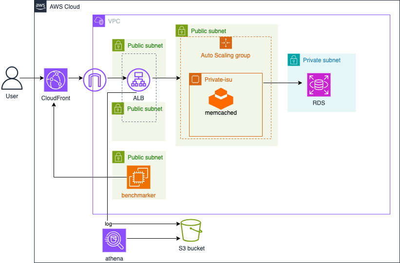

# 概要
  
本セクションでは、Amazon CloudFront を導入し、静的ファイル（CSS, JavaScript, 一部の画像など）をエッジロケーションにキャッシュすることで、オリジンサーバー（ALB経由のEC2）への負荷を軽減し、ユーザーへのレスポンス速度を向上させます。

<details>
<summary>CloudFrontのメリット</summary>
<ul>
<li><strong>高速なコンテンツ配信:</strong> 世界中に分散されたエッジロケーションからコンテンツを配信し、レイテンシを低減します。</li>
<li><strong>オリジン負荷軽減:</strong> キャッシュによりオリジンサーバーへのリクエスト数を削減します。</li>
<li><strong>セキュリティ:</strong> AWS Shield StandardによるDDoS緩和が自動的に有効。AWS WAFとの統合も容易です。</li>
<li><strong>コスト削減:</strong> データ転送量やオリジンへのリクエスト数を削減することでコストを最適化できます。</li>
<li><strong>カスタマイズ可能:</strong> キャッシュ動作、SSL証明書、地理的制限など、柔軟な設定が可能です。</li>
</ul>
</details>

# 構築手順
1. CloudFrontディストリビューションを定義するTerraformファイル `cloudfront.tf`、ローカル変数を定義するファイル `locals.tf` を作成します。

2. 以下は、CloudFrontディストリビューションを定義するTerraformコードです。オリジンは前のステップで作成したALBを指定します。  
  ここで静的コンテンツや画像をキャッシュする設定を行っているので確認しましょう。

    <details>
    <summary>cloudfront.tf</summary>

    ```
    resource "aws_cloudfront_distribution" "alb" {
      origin {
        domain_name = aws_lb.private_isu_alb.dns_name
        origin_id   = "alb-origin"

        custom_origin_config {
          http_port              = 80
          https_port             = 443
          origin_protocol_policy = "http-only"
          origin_ssl_protocols   = ["TLSv1.2"]
        }

        custom_header {
          name  = "X-Custom-Header"
          value = local.custom_header_value
        }
      }

      enabled = true

      default_cache_behavior {
        viewer_protocol_policy   = "allow-all"
        allowed_methods          = ["GET", "HEAD", "OPTIONS", "PUT", "POST", "PATCH", "DELETE"]
        cached_methods           = ["GET", "HEAD"]
        cache_policy_id          = "4135ea2d-6df8-44a3-9df3-4b5a84be39ad" # Managed-CachingDisabled
        target_origin_id         = "alb-origin"
        origin_request_policy_id = "216adef6-5c7f-47e4-b989-5492eafa07d3" # Managed-AllViewer
      }

      ordered_cache_behavior {
        path_pattern     = "/favicon.ico"
        target_origin_id = "alb-origin"

        viewer_protocol_policy = "allow-all"
        allowed_methods        = ["GET", "HEAD"]
        cached_methods         = ["GET", "HEAD"]
        cache_policy_id        = "658327ea-f89d-4fab-a63d-7e88639e58f6"
      }
      ordered_cache_behavior {
        path_pattern     = "/js/*"
        target_origin_id = "alb-origin"

        viewer_protocol_policy = "allow-all"
        allowed_methods        = ["GET", "HEAD"]
        cached_methods         = ["GET", "HEAD"]
        cache_policy_id        = "658327ea-f89d-4fab-a63d-7e88639e58f6"
      }
      ordered_cache_behavior {
        path_pattern     = "/css/*"
        target_origin_id = "alb-origin"

        viewer_protocol_policy = "allow-all"
        allowed_methods        = ["GET", "HEAD"]
        cached_methods         = ["GET", "HEAD"]
        cache_policy_id        = "658327ea-f89d-4fab-a63d-7e88639e58f6"
      }
      ordered_cache_behavior {
        path_pattern     = "/image/*"
        target_origin_id = "alb-origin"

        viewer_protocol_policy = "allow-all"
        allowed_methods        = ["GET", "HEAD", "OPTIONS", "PUT", "POST", "PATCH", "DELETE"]
        cached_methods         = ["GET", "HEAD"]
        cache_policy_id        = aws_cloudfront_cache_policy.image.id
      }

      price_class = "PriceClass_All"

      restrictions {
        geo_restriction {
          restriction_type = "none"
          locations        = []
        }
      }

      viewer_certificate {
        cloudfront_default_certificate = true
      }
    }

    resource "aws_cloudfront_cache_policy" "image" {
      name = "image-cache-policy"

      default_ttl = 60
      max_ttl     = 60
      min_ttl     = 60

      parameters_in_cache_key_and_forwarded_to_origin {
        cookies_config {
          cookie_behavior = "none"
        }

        headers_config {
          header_behavior = "none"
        }

        query_strings_config {
          query_string_behavior = "none"
        }
      }
    }
    ```
    </details>

    <details>
    <summary>sg.tf</summary>

    ```
    # 追加
    data "aws_ec2_managed_prefix_list" "cloudfront" {
      name = "com.amazonaws.global.cloudfront.origin-facing"
    }

    # 変更
    resource "aws_vpc_security_group_ingress_rule" "alb" {
      security_group_id = aws_security_group.alb.id
      from_port         = 80
      to_port           = 80
      ip_protocol       = "tcp"
      prefix_list_id    = data.aws_ec2_managed_prefix_list.cloudfront.id # CloudFrontからのアクセスに制限する
    }
    ```
    </details>

    <details>
    <summary>locals.tf</summary>

    ```
    locals {
      custom_header_value = "1I2baZBWn8!E" # CloudFrontからのリクエストを識別するためのカスタムヘッダー値
    }
    ```
    </details>

    <details>
    <summary>alb.tf</summary>

    ```
    # 変更
    resource "aws_lb_listener" "private_isu" {
      load_balancer_arn = aws_lb.private_isu_alb.arn
      port              = 80
      protocol          = "HTTP"

      default_action {
        type = "fixed-response"

        fixed_response {
          content_type = "text/plain"
          status_code  = "503"
        }
      }
    }

    # 追加
    resource "aws_lb_listener_rule" "private_isu" {
      listener_arn = aws_lb_listener.private_isu.arn
      priority     = 100

      action {
        type             = "forward"
        target_group_arn = aws_lb_target_group.private_isu.arn
      }

      condition {
        http_header {
          http_header_name = "X-Custom-Header"
          values           = [local.custom_header_value]
        }
      }
    }
    ```
    </details>

3. 実行計画を確認し、適用します。
    ```
    terraform plan
    terraform apply
    ```

    ※`CloudFrontディストリビューション`の作成には数分かかります。
    
4. 動作確認
    CloudFrontディストリビューションのドメイン名（例: xxxxxx.cloudfront.net）にアクセスし、アプリケーションが表示されることを確認します。
    

5. ベンチマークの実行と考察
    CloudFront経由でベンチマークを実行し、スコアを比較してください。  
    特に、CloudFrontによってキャッシュされたコンテンツへのアクセスが減っていることを確認しましょう。

    ```sh
    /home/isucon/private_isu/benchmarker/bin/benchmarker -u /home/isucon/private_isu/benchmarker/userdata -t https://{CloudFrontのドメイン名}
    ```

[⬅️ 前のセクションへ](../05-athena-log-analysis/README.md)　　　[次のセクションへ ➡️](../07-elasticache-integration/README.md)
