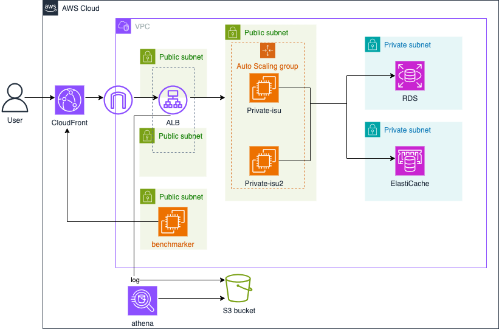

# 概要
 
最終セクションでは、ALBの配下にEC2インスタンス（アプリケーションサーバー）を複数台配置し、Auto Scalingを設定することで、スケーラビリティと可用性を向上させます。これにより、アクセス集中時にも安定したパフォーマンスを提供できるシステムを目指します。
<details>
<summary>Auto Scalingのメリット</summary>
<ul>
<li><strong>可用性の向上:</strong> インスタンスに障害が発生した場合、自動的に新しいインスタンスを起動して置き換えます。</li>
<li><strong>スケーラビリティ:</strong> 負荷に応じてインスタンス数を自動的に増減させ、常に適切なキャパシティを維持します。</li>
<li><strong>コスト最適化:</strong> 必要最小限のインスタンス数で運用し、不要なコストを削減します。</li>
<li><strong>運用の自動化:</strong> 手動でのインスタンス増減作業が不要になります。</li>
</ul>
</details>

# 構築手順
1. 04のALB追加の章でターゲットグループをすでに作成している為、新規インスタンスの作成とターゲットグループへのアタッチを行なっていきます。
    <details>
    <summary>ec2.tf</summary>

    ```
    resource "aws_instance" "private_isu_web02" {
        ami                         = "ami-04f51de327e6c4656" #Private-isu-AMI
        instance_type               = "c7a.large"
        iam_instance_profile        = aws_iam_instance_profile.private_isu_web_profile.name
        associate_public_ip_address = true
        vpc_security_group_ids      = [aws_security_group.private_isu_web.id]
        subnet_id                   = aws_subnet.public_1a.id
        user_data                   = <<-EOF
                snap install amazon-ssm-agent --classic
                snap start amazon-ssm-agent

            EOF
        tags = {
            Name = "Private-isu02"
        }
    }
    ```

    </details>

    <details>
    <summary>alb.tf</summary>

    ```
    resource "aws_lb_target_group_attachment" "private_isu02" {
        target_group_arn = aws_lb_target_group.private_isu.arn
        target_id        = aws_instance.private_isu_web02.id
    }
    ```
    </details>


2. 実行計画を確認し、適用します。
    ```
    terraform plan
    terraform apply
    ```

3. 動作確認
    ALBのターゲットグループで、新しいインスタンスが登録され、ヘルスチェックが正常になっていることを確認します。
    CloudFront経由でアプリケーションにアクセスできることを確認します。
4. ベンチマークの実行と考察
    複数台構成でベンチマークを実行し、スコアを比較してください。  
    単一インスタンス構成と比較して、スケーラビリティや高負荷時の安定性がどのように向上したか確認しましょう。

[⬅️ 前のセクションへ](../07-elasticache-integration/README.md)　　　[次のセクションへ ➡️](../09-multi-process/README.md)
